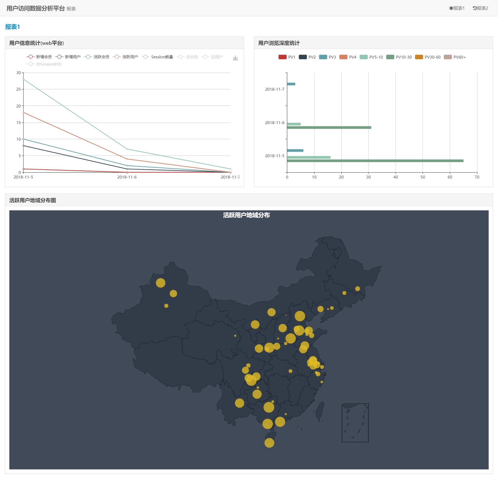

# 电商数据分析平台

## 功能模块

**1. 用户基本信息模块**

在时间、平台维度下：

* 活跃用户数量
* 新增用户数量
* 当前总用户数量
* 活跃会员数量
* 新增会员数量
* 当前总会员数量
* Session数量
* Seesion总时长

每小时数据指标分析：

根据不同的指标类型在时间、平台维度上进行每小时的指标计算

**2. 浏览器信息模块**

在时间、平台、浏览器维度下：

* 活跃用户数量
* 新增用户数量
* 当前总用户数量
* 活跃会员数量
* 新增会员数量
* 当前总会员数量
* Session数量
* Seesion总时长
* PV

**3. 地域信息模块**

在时间、平台、位置维度下：

* 活跃用户数量
* Session数量
* 跳出数（仅访问一次）

**4. 外链信息模块**

在时间、平台、外链源的维度下：

* 活跃用户数量
* Session数量
* 跳出数（仅访问一次）

**5. 用户浏览深度模块**

通过PV值来表示用户的浏览深度，统计在对应的PV范围下不同指标类型的数量

例如：
* 不同浏览深度中的用户数量
* 不同浏览深度中的Session数量

**6. 事件信息模块**

分析事件的触发次数，通过查看事件的触发次数，我们可以得到事件转换率和用户会此类事件的兴趣所在之处以及不喜之处。

在时间、平台维度下统计不同事件的触发次数

**7. 订单信息模块**

在时间、平台、支付货币、支付方式维度下：

* 订单数量
* 支付成功订单数量
* 退款订单数量
* 订单总金额
* 支付成功订单的总金额
* 退款订单的总金额
* 迄今为止，支付成功订单的总金额
* 迄今为止，退款订单的总金额

**8. 可视化模块**

* 用户基本信息统计
* 用户浏览深度统计
* 活跃用户地域分布统计

